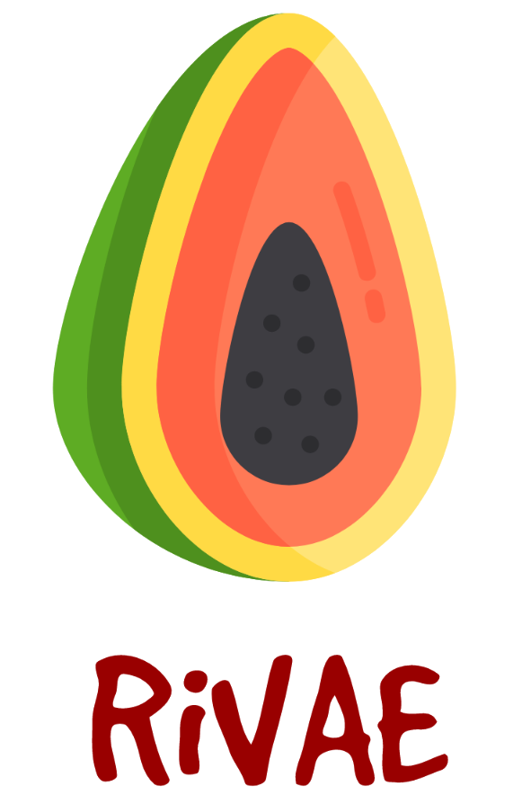
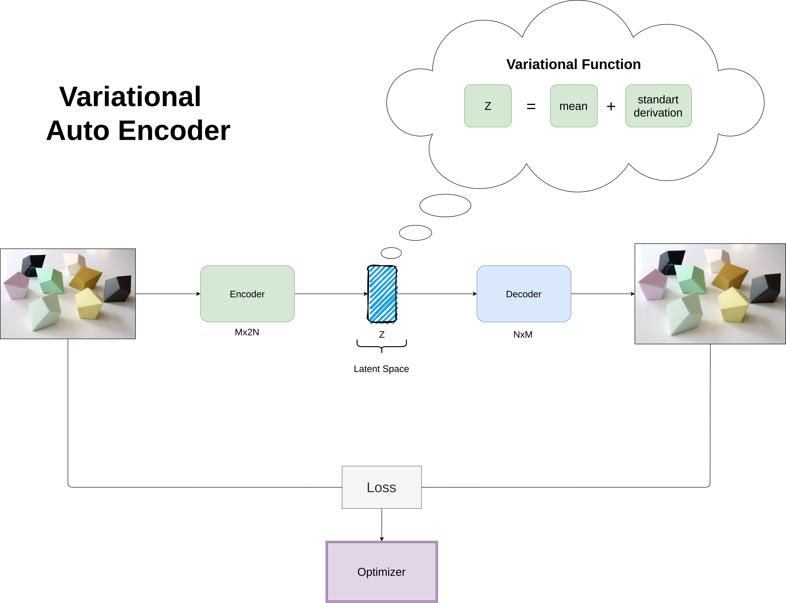

<h1 align="center">RiVAE</h1>
<h3 align="center">Real to Imaginary Variational Auto Encoder</h3>

<p align="center"> 
  
  
  
  
  
  
  
  
</p>
<br/>

## Objective
<p align="justify"> 
  
  <a>The goal of this project is to convert real and virtual images into a general imaginary image. It is the search for a medium between the real and the virtual from a visual interpretation of the environment. This project aims to assist in tasks of deep reinforcement learning by enabling a virtual training and at the same time an interpretation of reality.</a>  
</p>
  

## Setup
<p align="justify"> 
 <a>All of requirements is show in the badgets above, but if you want to install all of them, enter the repository and execute the following line of code:</a>
</p>

```shell
pip3 install -r requirements.txt
```

<p align="justify"> 
 <a>With the videos from a virtual environment inside the data/video folder we can now do the process of image extraction from the video. To perform the extraction run the following code:</a>
</p>

```shell
python3 image_extractor.py
```

<p align="justify"> 
 <a>With the extracted images, now we can train our RiAE network, to do this just run the following code:</a>
</p>

```shell
python3 rivae.py
```

## Structure
<p align="justify"> 
  The way RiVAE works is somewhat simple. We extract the images from a virtual video, then go through an auto encoder and calculate the error of the docoder output image with the ground truth image to update the weights. Something very similar to a conventional variational auto encoder, the difference here is in the focus of the project.
</p>

<p align="center"> 
  
</p>  

<p align="center"> 
  <i>If you liked this repository, please don't forget to starred it!</i>
  
</p>
